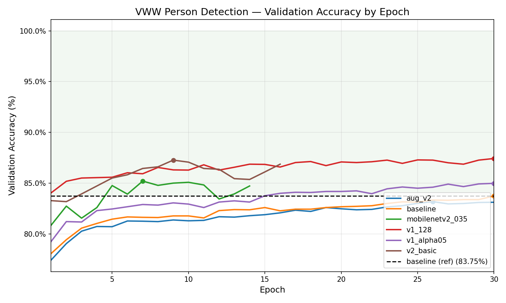
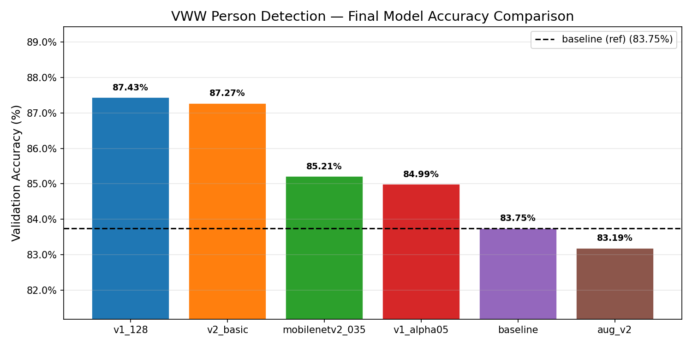
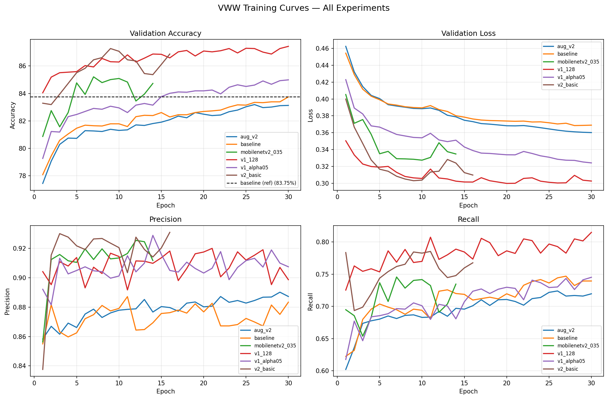

# Model Training for VWW Person Detection

Training & Comparing Code for VWW task using the COCO and Wake Vision datasets 
Goal: beat the baseline MobileNet V1 0.25 accuracy

---

## Directory Structure

```
main/
├── src/
│   ├── experiments/        # Experiment scripts (for model training & comparison)
│   │   ├── train_experiment.py     # Training engine + ModelConfig
│   │   ├── experiment_configs.py   # All model experiment definitions
│   │   ├── run_experiments.py      # Runs all/selected experiments
│   │   ├── compare_results.py      # Generates comparison plots
│   │   ├── download_wake_vision.py # Downloads Wake Vision dataset
│   │   ├── download.sh             # Downloads COCO annotations
│   │   └── main.py                 # Export weights to SavedModel
│   └── origin/             # Original reference scripts + 1st draft of training scripts
│       ├── simple_train.py
│       ├── create_coco_vww_tf_record.py
│       ├── convert_tf_lite.py
│       ├── download_coco.sh
│       └── tf_micro.sh
├── data/ (Not included in github - about 20 GB of storage needed)
│   └── vww_tfrecord/
│       ├── coco2017/       # COCO TFRecords (training input)
│       └── wake_vision/    # Wake Vision TFRecords (training input)
├── models/                 # Saved best weights per experiment (.h5)
├── exported_models/        # SavedModels and .tflite files per experiment
└── results/
    ├── <experiment_name>/  # metrics.json per experiment
    └── plots/              # Generated comparison charts
```

---

## Step 1 — Prepare COCO Dataset

```bash
bash src/origin/download_coco.sh ~/coco_dataset 2017
```

Convert COCO to VWW TFRecords:

```bash
python src/origin/create_coco_vww_tf_record.py \
  --train_image_dir ~/coco_dataset/Images \
  --val_image_dir ~/coco_dataset/Images_val \
  --train_annotations_file ~/coco_dataset/annotations/train.json \
  --val_annotations_file ~/coco_dataset/annotations/val.json \
  --output_dir data/vww_tfrecord/coco2017
```

This labels each image as person (1) or no-person (0) and writes 100 sharded TFRecord files for train and 10 for val

---

## Step 2 — Download Wake Vision

Wake Vision has cleaner person/no-person labels than COCO-derived VWW
Required for the `scratch_v2` and `transfer_v2` experiments

```bash
pip install datasets huggingface_hub

python src/experiments/download_wake_vision.py
```

Downloads 120,000 training and 20,000 validation examples from HuggingFace (`Harvard-Edge/Wake-Vision`) and writes them as TFRecords to `data/vww_tfrecord/wake_vision/`. 
To change the sample count:

```bash
python src/experiments/download_wake_vision.py --train-samples 200000 --val-samples 20000
```

---

## Step 3 — Run Experiments

Trains all configured models sequentially. Already-completed experiments are skipped automatically

```bash
python src/experiments/run_experiments.py
```

Run specific experiments only:

```bash
python src/experiments/run_experiments.py --only baseline mobilenetv2_035
```

Skip specific experiments:

```bash
python src/experiments/run_experiments.py --skip scratch_v2 transfer_v2
```

Each experiment saves:
- Best weights : `models/<name>/best_val.weights.h5`
- Training metrics (per-epoch history + final accuracy) : `results/<name>/metrics.json`
- Exported SavedModel : `exported_models/<name>/saved_model`

A summary table is printed at the end comparing all experiments against the baseline.

### Configured Experiments

| Name | Architecture | Dataset | Notes |
|---|---|---|---|
| `baseline` | MobileNet V1 α=0.25, 96×96 | COCO | Reference model — all others compared against this |
| `aug_v2` | MobileNet V1 α=0.25, 96×96 | COCO | Adds color jitter + random crop augmentation |
| `v2_basic` | MobileNet V2 α=0.35, 96×96 | COCO | V2 architecture with basic augmentation |
| `mobilenetv2_035` | MobileNet V2 α=0.35, 96×96 | COCO | V2 architecture with strong augmentation |
| `v1_128` | MobileNet V1 α=0.25, 128×128 | COCO | Larger input resolution test |
| `v1_alpha05` | MobileNet V1 α=0.5, 96×96 | COCO | Higher-capacity MobileNet V1 |
| `scratch_v2` | MobileNet V2 α=0.35, 96×96 | Wake Vision | Trained from scratch (no ImageNet weights), Adam optimizer |
| `transfer_v2` | MobileNet V2 α=0.35, 96×96 | Wake Vision | Two-phase transfer learning: freeze 15 epochs ; unfreeze all at LR=1e-5 |

---

## Step 4 — Compare Results and Generate Plots

```bash
python src/experiments/compare_results.py
```

Reads all `results/*/metrics.json` files and saves four plots to `results/plots/`:

| File | Contents |
|---|---|
| `val_accuracy_curves.png` | Validation accuracy over epochs for all models |
| `final_accuracy_bar.png` | Final accuracy bar chart sorted by performance |
| `training_curves_4panel.png` | Accuracy, loss, precision, and recall in one figure |
| `size_vs_accuracy.png` | TFLite model size vs. accuracy scatter (requires Step 5) |

---

## Step 5 — Convert to TFLite (INT8 Quantized)

Converts a trained SavedModel to a fully integer-quantized TFLite model. Run from `tensorflow/`.

```bash
python src/origin/convert_tf_lite.py \
  --model-name <experiment_name> \
  --input-height 96 \
  --input-width 96
```

Use `--dataset fake` to skip representative data (faster but slightly lower quantization quality):

```bash
python src/origin/convert_tf_lite.py --model-name baseline --dataset fake
```

Output: `exported_models/<name>/model.tflite`

---

## Step 6 — Convert to TFLite Micro (C Array)

Converts a `.tflite` file into a C source file for deployment on MCUs

```bash
bash src/origin/tf_micro.sh <experiment_name>
```

Output: `exported_models/<name>/model_data.cc`

---

## Re-exporting Weights to SavedModel

If you have saved weights (`.h5`) and want to re-export to SavedModel without retraining:

```bash
python src/experiments/main.py
```

Edit the `MODEL_NAME`, `ALPHA`, `INPUT_HEIGHT`, `INPUT_WIDTH` variables at the top of `main.py` to match the model you want to export

## Results

| Experiment | Val Acc | AUC | Precision | Recall | Time | Beats baseline |
|---|---|---|---|---|---|---|
| `v1_128` | **87.43%** | 0.8932 | 0.8987 | 0.8149 | 10.7m | ✓ |
| `v2_basic` | **87.27%** | 0.8834 | 0.9236 | 0.7845 | 5.3m | ✓ |
| `mobilenetv2_035` | 85.21% | 0.8702 | 0.9124 | 0.7456 | 5.1m | ✓ |
| `v1_alpha05` | 84.99% | 0.8702 | 0.9075 | 0.7451 | 7.6m | ✓ |
| `baseline` | 83.75% | 0.8523 | 0.8834 | 0.7394 | 7.7m | — |
| `aug_v2` | 83.19% | 0.8560 | 0.8845 | 0.7239 | 7.6m | |
| `transfer_v2` | 81.09% | 0.8358 | 0.8707 | 0.7303 | 9.7m | |
| `scratch_v2` | 78.18% | 0.8037 | 0.8341 | 0.7036 | 17.2m | |

All COCO experiments use SGD + cosine decay. Wake Vision experiments (`scratch_v2`, `transfer_v2`) use Adam.





